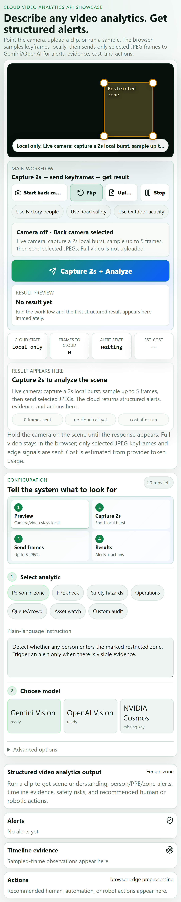
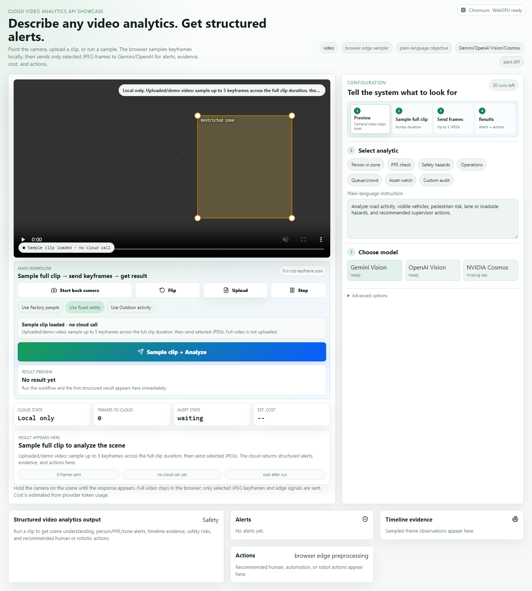
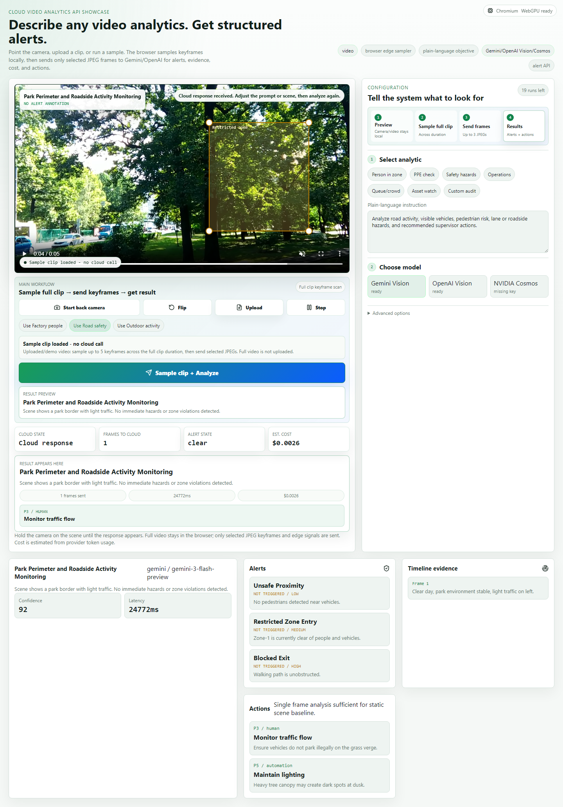

# Cloud Video Analyzer

Mobile-first physical AI and cloud video analytics demo.

Live demo: https://cloud-video-analyzer.vercel.app

This project shows how general-purpose multimodal models can be used as a flexible video analytics layer. A user can point a phone camera at a scene, upload a clip, or select a demo video, describe the analytics they need in plain language, and receive structured alerts, timeline evidence, recommended actions, latency, and estimated cloud cost.

The core architecture is intentionally hybrid: the browser does the lightweight video preprocessing, then only selected JPEG keyframes and edge signals are sent to cloud vision APIs. The full video is not uploaded by default.

## Screenshots

### Mobile workflow



### Desktop workflow



### Structured analysis result



## What It Demonstrates

- Physical AI workflow design for real-world camera input.
- Browser edge preprocessing before cloud inference.
- Plain-language configurable analytics instead of fixed rules.
- Industrial-style use cases: person detection, restricted-zone alerts, PPE checks, safety hazards, operations review, queue/crowd monitoring, and asset/layout review.
- Multimodal provider integration with Gemini and OpenAI Vision.
- Structured output suitable for dashboards, alert APIs, robot tasking, and human review.
- Production concerns: API-key isolation, request caps, frame sampling, payload limits, rate limiting, latency/cost display, and deployable PWA UI.

## Core User Flow

1. Preview a live camera feed, upload a clip, or select a built-in demo video.
2. For live video, capture a short local burst in the browser.
3. For uploaded or sample video, sample keyframes across the full clip duration.
4. Send only selected JPEG keyframes and metadata to the configured cloud model.
5. Render structured alerts, evidence, actions, and a browser-side annotation overlay.

## Demo Modes

- Live camera: phone or laptop camera preview, front/back camera toggle, short local capture window.
- Uploaded clip: local browser keyframe sampling across the clip; full video is not uploaded.
- Built-in clips: factory people flow, road safety, and outdoor activity samples.
- Drawn zone: resize a restricted zone directly over the video for person/zone analytics.
- Custom objective: write any analytics request in plain language.

## Architecture

```text
Camera / uploaded clip / sample video
        |
        v
Browser preprocessing
- capture window or full-clip keyframe sampling
- JPEG compression
- visual quality and motion metrics
- optional local object detection
        |
        v
Server-side provider router
- request validation
- payload and rate limits
- key isolation
- Gemini / OpenAI / optional NVIDIA-compatible adapter
        |
        v
Structured video analytics response
- scene summary
- objects and evidence
- alerts and severity
- timeline observations
- recommended human, automation, or robot actions
- token usage, latency, estimated cost
```

## Tech Stack

- Next.js App Router
- React
- TypeScript
- Gemini API via `@google/genai`
- OpenAI-compatible Responses API flow for vision frames
- MediaPipe Tasks Vision for browser-side object detection hooks
- Browser canvas keyframe extraction
- Vercel production deployment

## Environment

```bash
GEMINI_API_KEY=
GEMINI_MODEL=gemini-3-flash-preview
OPENAI_API_KEY=
OPENAI_MODEL=gpt-4o-mini
NVIDIA_API_KEY=
NVIDIA_MODEL=nvidia/cosmos3-nano-reasoner
NVIDIA_BASE_URL=https://integrate.api.nvidia.com/v1
NEXT_PUBLIC_DEMO_ANALYSIS_LIMIT=20
DEMO_MAX_REQUEST_BYTES=2500000
DEMO_RATE_LIMIT_WINDOW_MS=60000
DEMO_RATE_LIMIT_MAX_REQUESTS=24
```

## Local Development

```bash
npm install
npm run dev
```

Open `http://localhost:3000`.

Camera access requires a secure context in production, so phone demos should use the HTTPS Vercel URL.

## Production Notes

- API keys are server-side only.
- The browser does not upload full video by default.
- The server caps cloud analysis to selected sampled frames for latency and cost control.
- Internet-hosted videos may block canvas extraction unless CORS headers are present; uploaded files and bundled samples are reliable.
- Cost is a model-aware estimate based on returned token usage and the local pricing table. Provider dashboards remain the billing source of truth.
- There are no mock model fallbacks. Missing keys and provider failures return explicit errors.

## Verified Production Flows

- Production deployment on Vercel.
- iPhone viewport workflow.
- Live camera path with fake-camera automation.
- Built-in sample clip workflow.
- Gemini Vision analysis on road/factory/general activity clips.
- OpenAI Vision analysis on road/factory/general activity clips.
- Browser-rendered result and annotation overlay.
